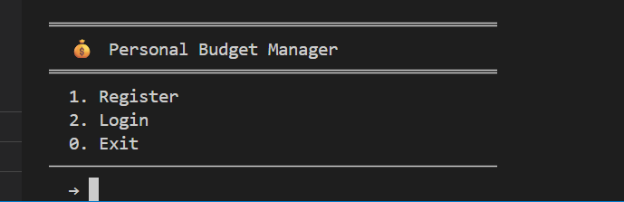
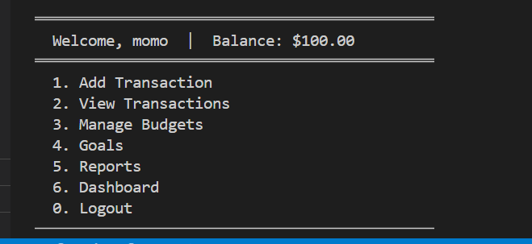
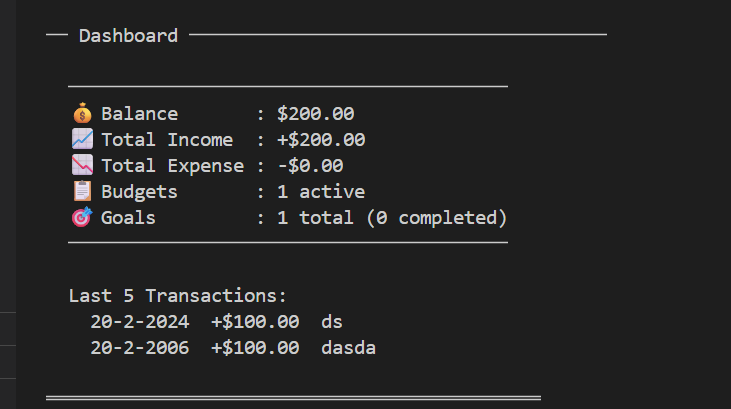
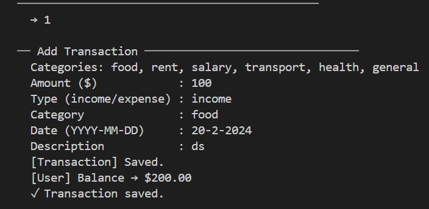
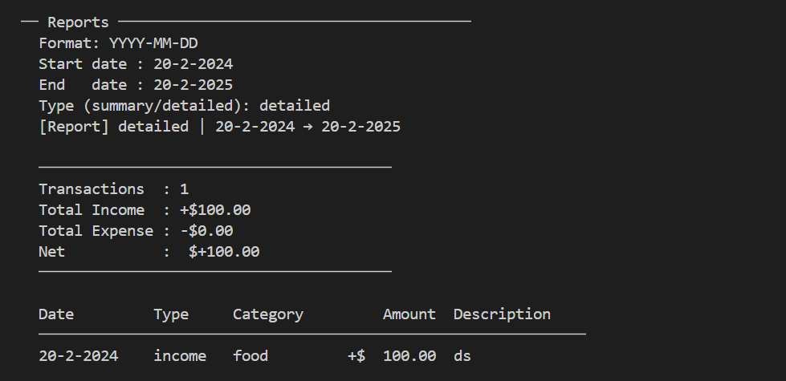
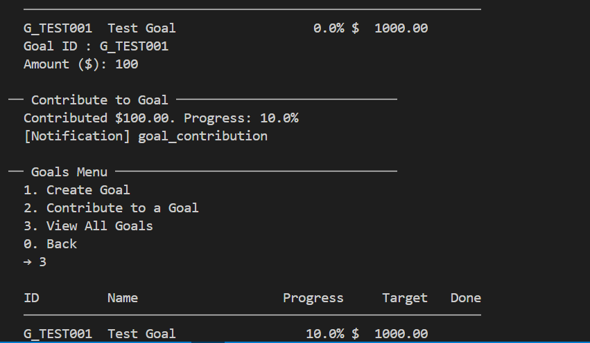

<div align="center">

# 💰 Personal Budget Manager

### A CLI-based personal finance tracking application built with Python


**CS251 — Introduction to Software Engineering | Spring 2025/2026**  
Cairo University · Faculty of Computers and Artificial Intelligence

---

[Features](#-features) · [Architecture](#-architecture) · [Getting Started](#-getting-started) · [Screenshots](#-screenshots) · [Team](#-team)

</div>

---

## 📌 Overview

**Personal Budget Manager** is a command-line application that helps users track income and expenses, manage budgets, set financial goals, and generate detailed reports — all stored locally using JSON files.

Built following **SOLID principles**, a **Three-Tier Layered Architecture**, and key **GoF Design Patterns**.

---

## ✨ Features

| Feature | Description |
|---|---|
| 🔐 **Authentication** | Register & login with hashed passwords, session management |
| 💳 **Transactions** | Add income/expense entries with categories, dates, and descriptions |
| 📋 **Budget Management** | Per-category limits with real-time alert thresholds |
| 🎯 **Goals** | Set savings targets, track contributions & percentage progress |
| 📊 **Reports** | Summary & detailed reports with custom date ranges |
| 🖥️ **Dashboard** | Live balance, income/expense totals, last 5 transactions |
| 🏦 **Bank Sync** | Import external transactions via `external_id` |
| 🔔 **Notifications** | System alerts for budget limits and goal milestones |

---

## 🏗️ Architecture

The project follows a **Three-Tier Layered Architecture**:

```
┌─────────────────────────────────────────┐
│         Presentation Layer (UI)         │
│  Login · Menu · Transactions · Reports  │
├─────────────────────────────────────────┤
│       Application Layer (Business)      │
│  UserService · TransactionService       │
│  BudgetService · GoalService · Reports  │
├─────────────────────────────────────────┤
│       Data Layer (Persistence)          │
│  JSON Storage · users.json              │
│  transactions.json · goals.json         │
└─────────────────────────────────────────┘
```

### 📐 SOLID Principles Applied

- **S** — Single Responsibility: Each class handles one concern (e.g. `Transaction.py`, `Budget.py`)
- **O** — Open/Closed: New transaction types can be added without modifying existing code
- **L** — Liskov Substitution: `Income` & `Expense` are subclasses of `Transaction`

### 🎨 Design Patterns

- **Observer** — `Budget` notifies via `Notification` when spending nears the limit
- **Factory Method** — `Transaction` factory creates the correct type based on input
- **Singleton** — `Storage` module loads once per session; all classes share the same instance

---

## 📁 Project Structure

```
personal-budget-manager/
│
├── data/
│   ├── users.json          # User accounts & balances
│   ├── transactions.json   # All income/expense records
│   ├── budgets.json        # Budget limits per category
│   └── goals.json          # Savings goals & progress
│
├── Admin.py                # Admin panel & user management
├── Budget.py               # Budget creation & alert logic
├── Category.py             # Expense/income categories
├── Goal.py                 # Goal tracking & contributions
├── Main.py                 # Entry point & app bootstrap
├── Menu.py                 # CLI menu navigation
├── Notification.py         # Alert & notification system
├── Report.py               # Summary & detailed reports
├── Storage.py              # JSON persistence layer
├── Transection.py          # Transaction model & logic
└── User.py                 # User model & authentication
```

---

## 🚀 Getting Started

### Prerequisites

- Python **3.11+**
- No external libraries required — uses only the Python standard library

### Installation

```bash
# 1. Clone the repository
git clone https://github.com/Mohamedsherif-S/personal-budget-manager.git
cd personal-budget-manager

# 2. Run the application
python Main.py
```

### First Run

```
💰  Personal Budget Manager
──────────────────────────────
1. Register
2. Login
0. Exit
→
```

Register a new account, then explore all features from the main menu.

---

<table>
  <tr>
    <td align="center"><b>🔐 Login Screen</b></td>
    <td align="center"><b>📋 Main Menu</b></td>
  </tr>
  <tr>
    <td></td>
    <td></td>
  </tr>
  <tr>
    <td align="center"><b>🖥️ Dashboard</b></td>
    <td align="center"><b>💳 Add Transaction</b></td>
  </tr>
  <tr>
    <td></td>
    <td></td>
  </tr>
  <tr>
    <td align="center"><b>📊 Reports</b></td>
    <td align="center"><b>🎯 Goals</b></td>
  </tr>
  <tr>
    <td></td>
    <td></td>
  </tr>
</table>

---

## 🗂️ Data Schema

<details>
<summary><b>users.json</b></summary>

```json
{
  "U001": {
    "user_id": "U001",
    "username": "momo",
    "email": "1010@gmail.com",
    "password": "<sha256-hash>",
    "phone": "01017733004",
    "balance": 200.0
  }
}
```
</details>

<details>
<summary><b>transactions.json</b></summary>

```json
[
  {
    "user_id": "U001",
    "amount": 1500.0,
    "type": "income",
    "category_id": "salary",
    "date": "2026-05-03",
    "description": "Salary deposit",
    "external_id": "EXT001"
  }
]
```
</details>

<details>
<summary><b>goals.json</b></summary>

```json
[
  {
    "goal_id": "G_TEST001",
    "user_id": "U001",
    "name": "Test Goal",
    "target": 1000.0,
    "deadline": "2026-12-31",
    "current": 100.0,
    "completed": false
  }
]
```
</details>

---

## 👥 Team

| Name | ID | Contribution |
|---|---|---|
| **Mohamed Sherif Ahmed** | 20240501 | Sequence Diagrams & Sequence Usage Table |
| **Taghrid Ashraf Mohamed** | 20240219 | Class Descriptions & State Diagram |
| **Menna Tarek Saad** | 20240295 | Part of Class Diagram & SOLID Principles |
| **Hazem Hussein Ahmed** | 20240315 | Architecture Diagram & Design Patterns |

---

## 📄 License

This project is submitted as coursework for **CS251 — Introduction to Software Engineering**, Cairo University, Spring 2025/2026.

---

<div align="center">
Made with ❤️ by the SDS Team · Cairo University
</div>
